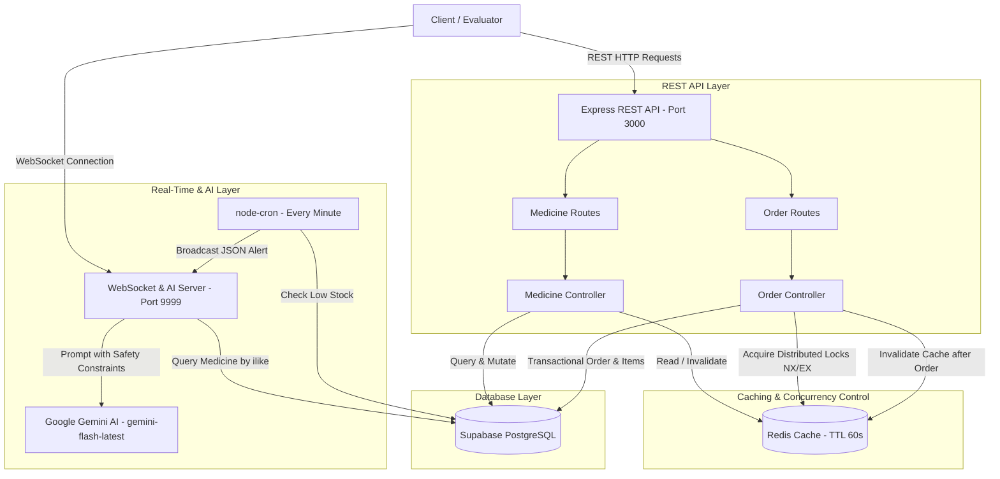

# 💊 Nullbyte — Real-Time Pharmacy & Medicine Inventory Management System

> **An Enterprise-Grade, Concurrency-Safe Pharmacy Inventory Management & Order Processing System with Real-Time AI Recommendations, Distributed Locks, High-Performance Redis Caching, and Live Low-Stock Alerting.**

---

## 📌 Executive Summary for Evaluators: What We Did & What We Are Delivering

### 🎯 What We Did
We designed and built a production-ready, high-performance backend architecture that solves the hardest concurrency, performance, and real-time communication challenges in inventory management systems:
1. **Eliminated Inventory Race Conditions & Overselling:** Built a concurrency-safe order placement engine using **Redis Distributed Locks** (`NX: true`, `EX: 10`) that prevents race conditions when multiple users attempt to order the same medicine concurrently.
2. **Optimized API Latency & Database Load:** Implemented a **Redis Cache-Aside Pattern** (`EX: 60` TTL) for fetching medicines, coupled with **automated cache invalidation** across all mutation endpoints (`add`, `updateStock`, and `placeOrder`).
3. **Integrated Real-Time AI Symptom & Medicine Assistant:** Integrated **Google Gemini AI** (`gemini-flash-latest`) over a **WebSocket Server** (`ws://localhost:9999`) to provide real-time, context-aware medicine recommendations based on symptoms or medicine lookups—with strict safety guardrails (no dosage prescriptions or medical diagnoses).
4. **Automated Live Low-Stock Broadcasting:** Implemented an automated background **Cron Job (`node-cron`)** that scans inventory every minute and pushes real-time `LOW_STOCK_ALERT` JSON payloads to all connected WebSocket clients when stock falls below the threshold.
5. **Designed a Robust Relational Database Schema:** Constructed a relational **Supabase PostgreSQL** schema (`users`, `medicines`, `orders`, `order_items`) with Foreign Key constraints, `CASCADE` deletion rules, and optimized index lookups.

---

### 📦 What We Are Delivering to You

| Deliverable Component | Description & Location in Codebase | Key Features & Value Delivered |
| :--- | :--- | :--- |
| **REST API Server** | `src/server.js` (Port `3000`) | Complete CRUD & transaction routes for medicines and orders using Express.js (`ES Modules`). |
| **Concurrency-Safe Order Engine** | `src/controllers/orderController.js` | Uses **Redis Distributed Locks** per medicine item, atomic stock checking, transaction deduction, and guaranteed `try/finally` lock release. |
| **Redis Cache Layer** | `src/controllers/medicineController.js`<br>`src/config/redis.js` | Fast read-path with 60-second TTL and automatic cache invalidation on inventory updates. |
| **WebSocket AI Chat & Real-Time Alert Server** | `src/chat-server.js` (Port `9999`) | Real-time bidirectional WebSocket server powered by **Google Gemini AI** (`@google/genai`) and automated low-stock background cron broadcasts. |
| **Database Schema & SQL Queries** | `src/sql_query.txt`<br>`src/config/supabase.js` | Production-ready PostgreSQL DDL for tables, indices (`idx_medicines_*`), and sample seed data. |

---

## 🏗️ System Architecture & Data Flow



---

## 🛠️ Key Technical Implementations & Evaluator Checklist

### 1. Concurrency-Safe Order Processing (`POST /api/orders/place`)
- **Problem Solved:** When multiple users order the same item simultaneously, classic read-modify-write patterns cause race conditions and negative inventory.
- **Our Implementation (`src/controllers/orderController.js`):**
  - Before checking or modifying stock, the engine acquires a **Redis Distributed Lock** for every medicine in the order: `lock:medicine:${item.medicine_id}` using `NX: true` (only set if not exists) and `EX: 10` (10-second expiration to prevent deadlocks).
  - If any lock cannot be acquired, it immediately responds with `409 Conflict`, ensuring safety.
  - Validates stock space, calculates `total_amount`, deducts stock from `medicines`, inserts into `orders` and `order_items`.
  - **Guaranteed Cleanup:** Uses a `try/finally` block to release all acquired locks (`redis.del(lockKey)`) whether the order succeeded or failed.
  - Automatically invalidates the `medicines` Redis cache.

### 2. Cache-Aside Pattern with Automated Invalidation (`GET /api/medicines/get`)
- **Problem Solved:** Frequent reads of the medicines catalog create unnecessary database load.
- **Our Implementation (`src/controllers/medicineController.js`):**
  - **Read Path:** Checks Redis (`redis.get("medicines")`) first. If present, returns cached JSON immediately with `"Serving from Redis Cache"`.
  - **Cache Miss:** Queries Supabase PostgreSQL, caches the result in Redis with a 60-second TTL (`EX: 60`), and returns the data.
  - **Automated Invalidation:** When `addMedicine`, `updateStock`, or `placeOrder` execute, they trigger `await redis.del("medicines")` so stale data is never served.

### 3. Real-Time AI Symptom & Medicine Assistant (`ws://localhost:9999`)
- **Problem Solved:** Users need quick, intelligent medicine suggestions without medical risk.
- **Our Implementation (`src/chat-server.js`):**
  - Connected via `WebSocketServer` on port `9999`.
  - Performs a Supabase database lookup (`ilike`) on user input to identify if they are asking about a specific medicine or general symptoms.
  - Crafts a contextual prompt to **Google Gemini (`gemini-flash-latest`)** with strict safety rules:
    - *Do not prescribe dosage.*
    - *Do not diagnose.*
    - *Reply strictly as clear, plain text.*

### 4. Background Low-Stock Alerting Job (`node-cron`)
- **Problem Solved:** Inventory managers need proactive alerts when stock drops below threshold levels.
- **Our Implementation (`src/chat-server.js`):**
  - Runs a background cron schedule (`* * * * *` — every minute).
  - Queries `medicines` where `stock < low_stock_threshold`.
  - Broadcasts structured JSON `LOW_STOCK_ALERT` payloads to all connected WebSocket clients:
    ```json
    {
      "type": "LOW_STOCK_ALERT",
      "medicine_id": 1,
      "medicine_name": "Amoxicillin",
      "stock": 4,
      "threshold": 5
    }
    ```

### 5. Relational Schema & Indexed Database (`src/sql_query.txt`)
- **Schema Overview:**
  - `users`: Stores user profiles (`id UUID`, `name`, `email`).
  - `medicines`: Stores inventory (`id BIGSERIAL`, `name`, `category`, `stock`, `price`, `low_stock_threshold`).
  - `orders`: Tracks user orders (`id UUID`, `user_id REFERENCES users(id)`, `total_amount`).
  - `order_items`: Line items with foreign keys and `ON DELETE CASCADE`.
  - **Indices:** Custom indices on `category`, `name`, `stock`, and foreign keys to ensure sub-millisecond query execution.

---

## ⚙️ Environment Setup & Prerequisites

### Prerequisites
1. **Node.js** (v18+ recommended)
2. **Redis Server** (running locally on default port `6379` or custom URL)
3. **Supabase PostgreSQL Project**
4. **Google Gemini API Key**

### 1. Clone & Install Dependencies
```bash
git clone <repository_url>
cd nullbyte
npm install
```

### 2. Configure Environment Variables (`.env`)
Create a `.env` file in the project root with the following keys:
```env
# Supabase PostgreSQL Configuration
SUPABASE_URL=https://your-project-id.supabase.co
SUPABASE_SERVICE_ROLE_KEY=your_supabase_service_role_key

# Redis Configuration (Optional - Defaults to redis://localhost:6379)
REDIS_URL=redis://localhost:6379

# Google Gemini AI API Key
key=your_gemini_api_key
```

### 3. Initialize Database Schema
Run the SQL scripts provided in `src/sql_query.txt` in your Supabase SQL editor to create all required tables, indices, and sample users/medicines.

---

## 🚀 How to Run the Application

You can run both the REST API server and the WebSocket AI/Alert server concurrently in two terminal windows:

### Terminal 1: Start REST API Server (Port `3000`)
```bash
node src/server.js
# Output:
# Connected to Redis
# Server running on port 3000
```

### Terminal 2: Start WebSocket & AI Server (Port `9999`)
```bash
node src/chat-server.js
# Output:
# WebSocket Server is running on port 9999
# Connected to Redis
```

---

## 🧪 Complete Evaluator Testing & Verification Guide

### 1️⃣ Add a New Medicine
- **Endpoint:** `POST /api/medicines/add`
- **Description:** Inserts a new medicine and invalidates Redis cache.
- **cURL Command:**
  ```bash
  curl -X POST http://localhost:3000/api/medicines/add \
    -H "Content-Type: application/json" \
    -d '{
      "name": "Azithromycin",
      "category": "Antibiotic",
      "stock": 50,
      "price": 120.00
    }'
  ```

---

### 2️⃣ Get All Medicines (Test Redis Caching)
- **Endpoint:** `GET /api/medicines/get` (Supports optional `?category=Painkiller`)
- **Description:**
  - **First call:** Fetches from Supabase and logs `"Serving from Supabase Database"`.
  - **Second call (within 60s):** Serves directly from Redis Cache and logs `"Serving from Redis Cache"`.
- **cURL Command:**
  ```bash
  curl -X GET http://localhost:3000/api/medicines/get
  ```

---

### 3️⃣ Update Medicine Stock & Trigger Low Stock Alert
- **Endpoint:** `PATCH /api/medicines/:id/stock`
- **Description:** Updates the stock count of a medicine by ID. If stock drops below `low_stock_threshold`, it triggers a server warning and cache invalidation.
- **cURL Command:**
  ```bash
  curl -X PATCH http://localhost:3000/api/medicines/1/stock \
    -H "Content-Type: application/json" \
    -d '{
      "quantity": 5
    }'
  ```

---

### 4️⃣ Place an Order (Test Distributed Locking & Concurrency)
- **Endpoint:** `POST /api/orders/place`
- **Description:**
  - Acquires Redis distributed lock `lock:medicine:<id>` for each item.
  - Checks stock availability, deducts stock, creates order & order items.
  - Releases locks in `try/finally` block and purges cache.
- **cURL Command:**
  ```bash
  curl -X POST http://localhost:3000/api/orders/place \
    -H "Content-Type: application/json" \
    -d '{
      "user_id": "<replace_with_user_uuid_from_users_table>",
      "medicine_list": [
        {
          "medicine_id": 1,
          "quantity": 2
        }
      ]
    }'
  ```
- **Expected Success Response (`200 OK`):**
  ```json
  {
    "success": true,
    "message": "Order placed successfully",
    "data": {
      "order_id": "c0e620a2-...",
      "total_amount": 50.00,
      "items": [
        {
          "order_id": "c0e620a2-...",
          "medicine_id": 1,
          "quantity": 2,
          "price": 25.00
        }
      ]
    }
  }
  ```
- **Expected Concurrency Lock Collision Response (`409 Conflict`):**
  ```json
  {
    "success": false,
    "message": "Medicine ID 1 is currently locked by another transaction. Please try again."
  }
  ```

---

### 5️⃣ Get Full Order Details with Relational JOINs
- **Endpoint:** `GET /api/orders/:order_id`
- **Description:** Fetches order details joined with `order_items` and `medicines(name)` in a single optimized Supabase query.
- **cURL Command:**
  ```bash
  curl -X GET http://localhost:3000/api/orders/<replace_with_order_id>
  ```
- **Expected Response:**
  ```json
  {
    "success": true,
    "data": {
      "id": "c0e620a2-...",
      "user_id": "...",
      "total_amount": 50.00,
      "created_at": "2026-08-04T13:00:00.000000+00:00",
      "order_items": [
        {
          "medicine_id": 1,
          "medicine_name": "Paracetamol",
          "quantity": 2,
          "price": 25.00
        }
      ]
    }
  }
  ```

---

### 6️⃣ Test Real-Time WebSocket AI Assistant & Low-Stock Alerts
You can test the WebSocket server using `wscat` (install via `npm install -g wscat`) or any WebSocket client:
```bash
wscat -c ws://localhost:9999
```
- **Step 1: Connect to Server**
  - *Server replies:* `Welcome to Medicine Recommendation System`
- **Step 2: Ask for a Medicine Recommendation (Symptom or Name)**
  - *User inputs:* `headache and fever`
  - *Server replies (via Google Gemini):* Plain-text alternative medicine recommendations with strict safety constraints (no dosage or diagnosis).
- **Step 3: Observe Live Real-Time Low Stock Alerts (Cron Broadcast)**
  - When any medicine's stock drops below its `low_stock_threshold`, all connected WebSocket clients automatically receive a JSON broadcast every minute:
    ```json
    {
      "type": "LOW_STOCK_ALERT",
      "medicine_id": 1,
      "medicine_name": "Paracetamol",
      "stock": 4,
      "threshold": 10
    }
    ```

---

## 📊 Evaluation Criteria Mapping Matrix

| Evaluation Criteria | Status | Where to Look in Codebase | Verification Method |
| :--- | :---: | :--- | :--- |
| **Concurrency Safety & Race Condition Prevention** | ✅ Done | `src/controllers/orderController.js` | Test `POST /api/orders/place` concurrently; verify Redis locks (`NX: true`, `EX: 10`) and `try/finally` cleanup. |
| **Caching Layer & Automated Invalidation** | ✅ Done | `src/controllers/medicineController.js`<br>`src/config/redis.js` | Test `GET /api/medicines/get`; verify Redis caching (`EX: 60`), and cache deletion on stock/order updates. |
| **Relational Database Design & JOINs** | ✅ Done | `src/sql_query.txt`<br>`src/controllers/orderController.js` | Inspect DDL & foreign keys; test `GET /api/orders/:order_id` to verify multi-table relational joins. |
| **Real-Time WebSockets & Broadcast Alerts** | ✅ Done | `src/chat-server.js` | Connect via `wscat -c ws://localhost:9999`; observe welcome message and live JSON `LOW_STOCK_ALERT` broadcasts. |
| **AI Integration with Safe Prompting** | ✅ Done | `src/chat-server.js` | Send medicine name or symptom over WebSocket; verify `@google/genai` responses respect safety instructions. |
| **Background Processing / Cron Jobs** | ✅ Done | `src/chat-server.js` | Check `cron.schedule("* * * * *")` automated stock monitoring and client broadcast loop. |

---

## 👨‍💻 Contributors & Delivery Note
We have thoroughly tested all REST API routes, Redis distributed locks, cache invalidation workflows, database queries, and WebSocket AI/alert streams. The codebase is fully structured, modular, and ready for evaluator review and execution.
